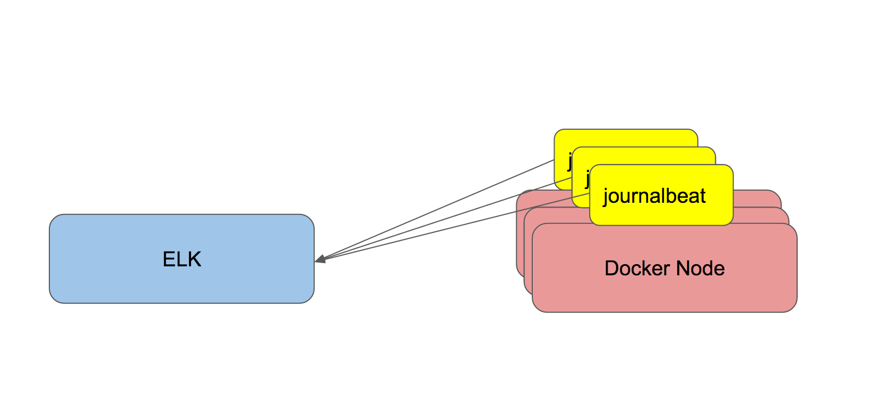

## Docker Enterprise Edition integration with ELK
**Summary:** Easy to use configuration for running and integrating ELK stack with Docker Enterprise Edition. The goal here is to ship docker engine and container/service logs to ELK. This can be done using the following steps:




**Step 1** On a separate/dedicated node for ELK (recommended to be outside of the Docker EE cluster), run the following:

```
$ docker swarm init # this would allow us to run services on this node
$ git clone https://github.com/nicolaka/elk-dee.git
$ cd elk-dee
$ docker stack deploy -c elk-docker-compose.yml elk
```

**Step 2:** Set up Docker cluster logging

You need to set up Docker daemon logging configuration to default to using `journald`. The reason we're doing this is to ensure that you can have a local copy of the logs to be able to use `docker logs` and `docker service logs`. 

This is the recommended logging configuration to place in`/etc/docker/daemon.json`:

```
{
  "log-driver": "journald",
  "log-level": "debug",
  "log-opts": {
    "tag":"{{.ImageName}}/{{.Name}}/{{.ID}}"
  }
}
```

Make sure you restart or SIGHUP the Docker daemon after you change these configs.


**Step 3** Stream all Docker logs to ELK

This is done using a tool called [journalbeat](https://github.com/mheese/journalbeat). A modified version of it that we're using to work with Docker can be found [here](https://github.com/nicolaka/journalbeat).

We will run `journalbeat` as a `global` service in our Docker cluster. This requires that you configure Step 2 before hand. 

On one of the Docker manager nodes run the following:

```
$ git clone https://github.com/nicolaka/elk-dee.git
$ cd elk-dee
$ export LOGSTASH_HOST=<ELK NODE IP or DNS>
$ docker stack deploy -c journalbeat-docker-compose.yml journalbeat
```


**Step 4:** Proceed to access Kibana at `http://<ELK_IP_ADDRESS>:5601`. Enjoy!
 
 
 
